# 11046928_DCIT_205_IA 
# University of Ghana - Department of Computer Science Website


## Owner
**Name:** Oswald Kwaku Amoah

**ID:** 11046928


## Introduction

Welcome to the official website of the Department of Computer Science at the University of Ghana. This website provides information about the department's academic programs, short courses, events, and other relevant details. Whether you are a prospective student, current student, or just interested in the field of computer science, this website is designed to be a valuable resource for you.

## Purpose of the Website

The primary purpose of this website is to:

- **Provide Information:** Offer detailed information about the department's academic programs, including undergraduate and graduate courses.
- **Facilitate Communication:** Serve as a platform for communication between the department and students, providing updates on events, academic calendars, and more.
- **Showcase Short Courses:** Highlight short courses available for professionals seeking to enhance their skills.

## Project Setup

To clone and set up this project locally, follow these instructions:

1. **Clone the Repository:**
   ```bash
   git clone https://github.com/oswaldamoah/11046928_DCIT_205_IA
   ```

2. **Navigate to the Project Directory:**
   ```bash
   cd "[your-path]\11046928_DCIT_205_IA"

   ```

3. **Open HTML Files:**
   Open any of the HTML files (e.g., Home.html) in your preferred web browser to explore the website locally.

## What We've Learnt

Through the development of this website, we have gained experience in:

- **HTML and CSS:** Crafting well-structured HTML pages and styling them using CSS for a visually appealing design.
- **GitHub Collaboration:** Managing and collaborating on the project using Git and GitHub.

## Feedback and Contributions

We welcome feedback and contributions to enhance the website. If you find any issues or have suggestions for improvement, please open an issue or submit a pull request. We appreciate your collaboration!


---
# Screenshots

## **Home Page**

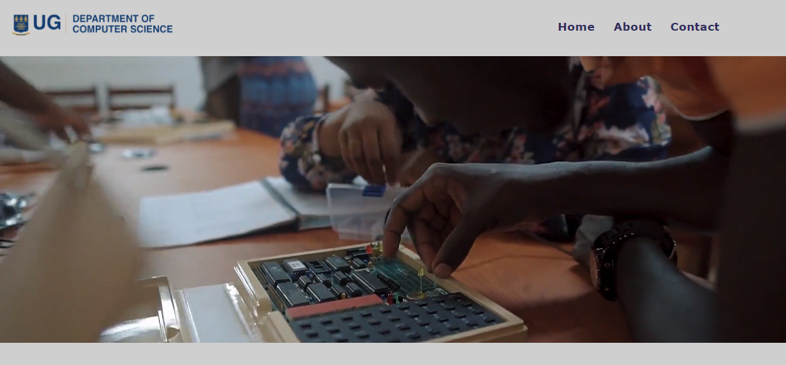

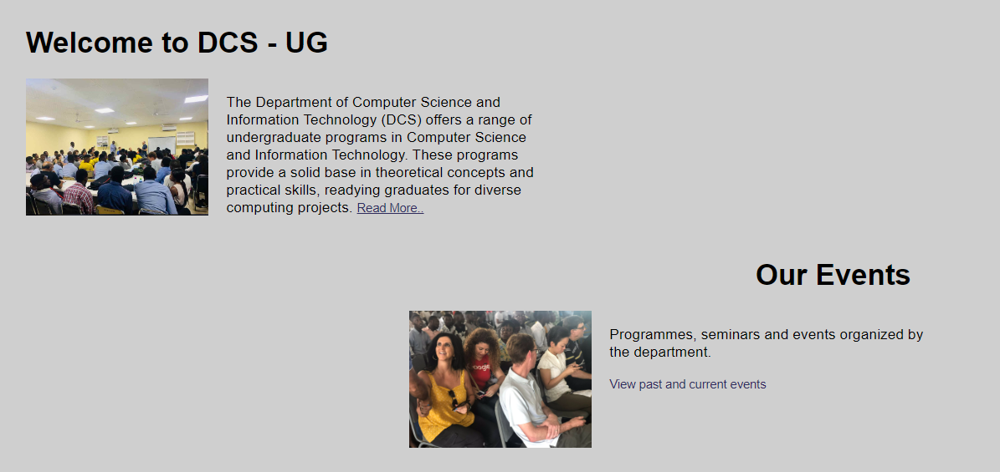

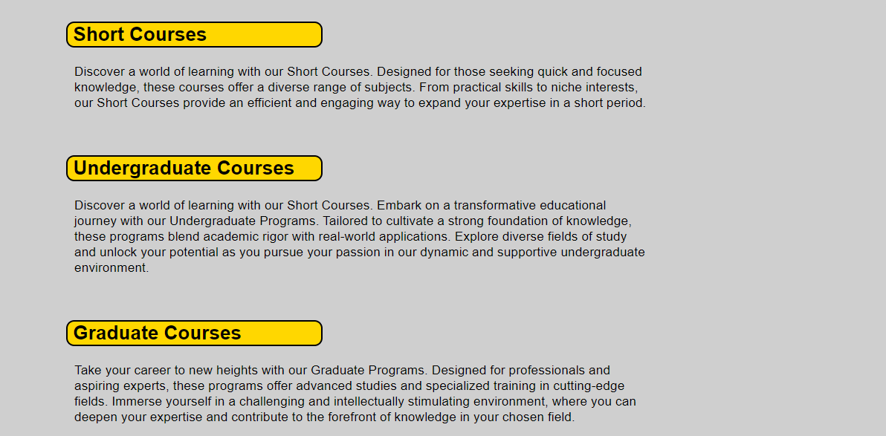

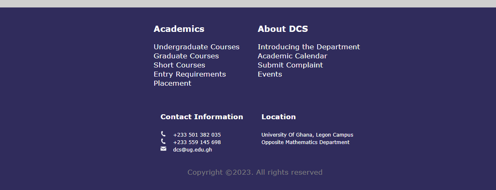

---
## **About Page**

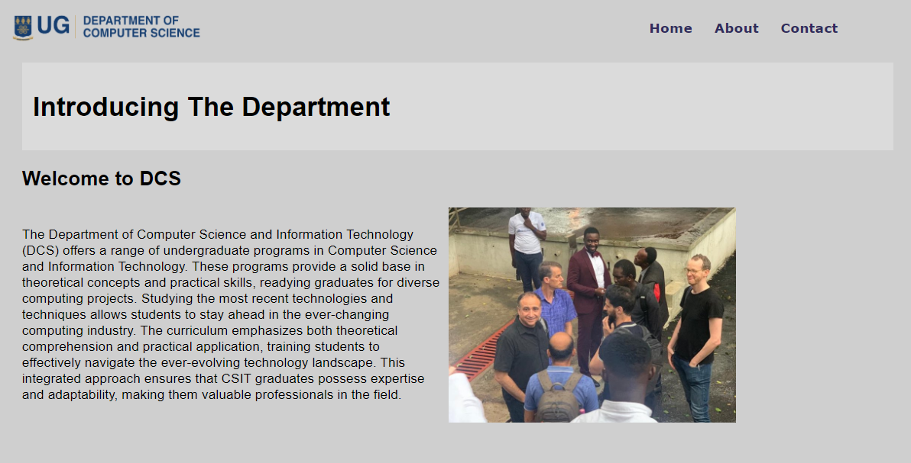

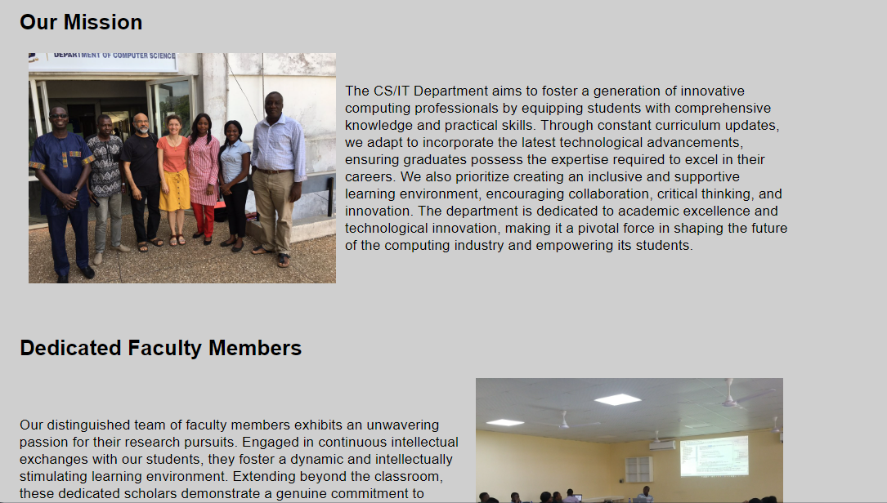

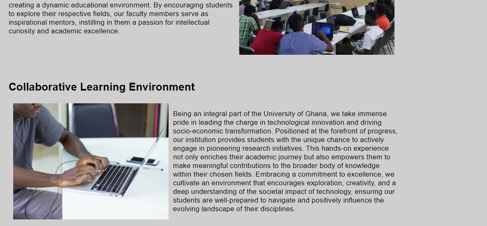


---
## **Student Complaint Page**

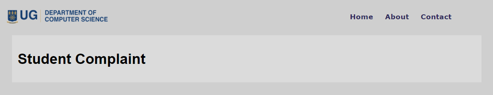

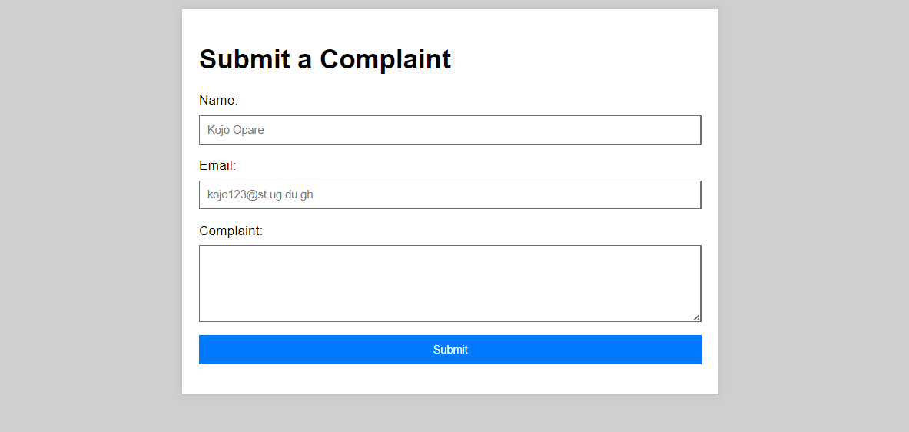


---
## **Events Page**

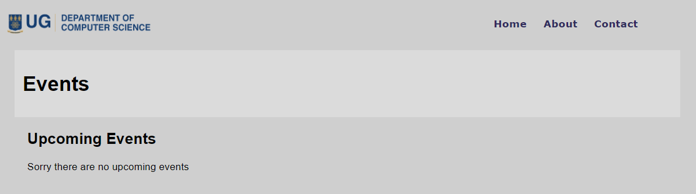

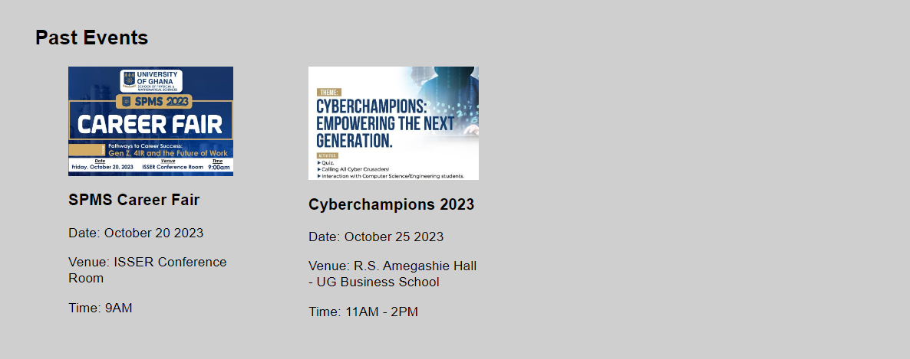


---
## **Academic Calendar Page**

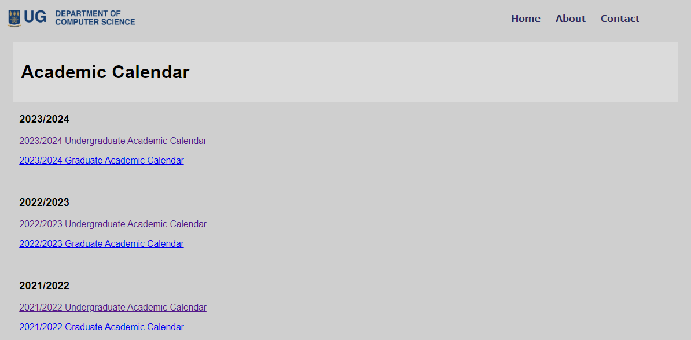


---
## **Placement Page**

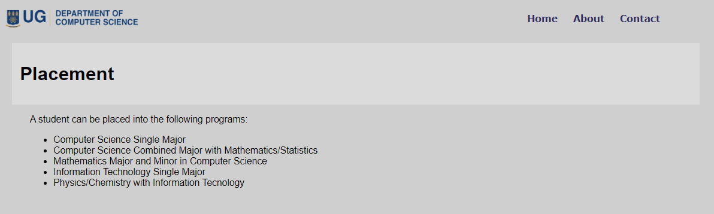

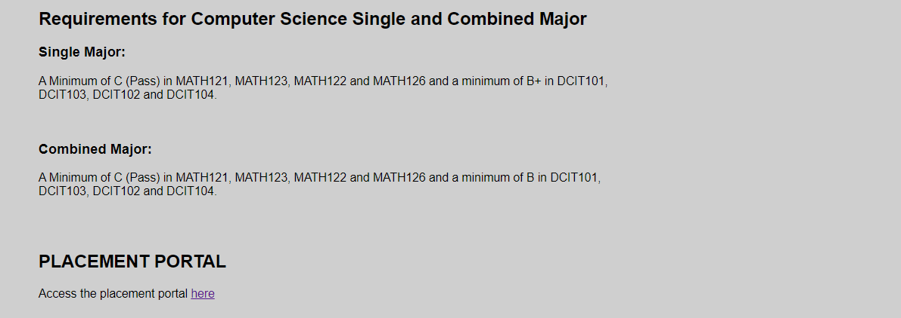


---

---
## **Undergraduate Page**

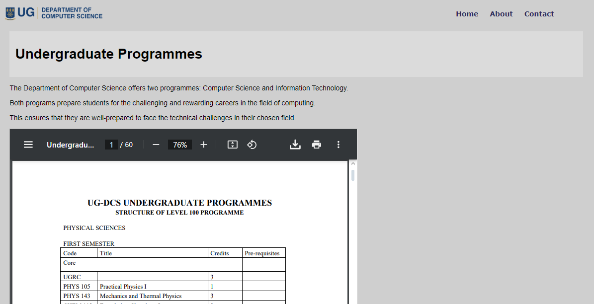

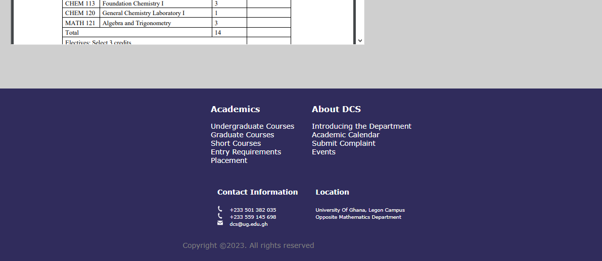


---
## **Graduate Page**

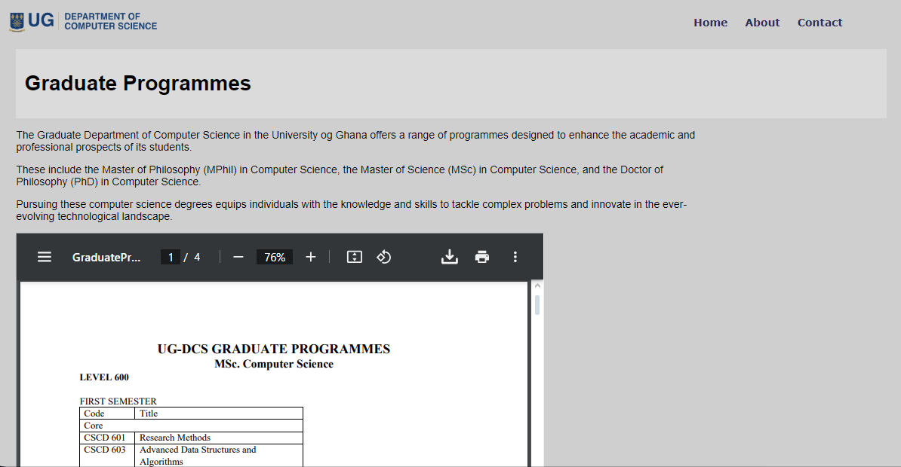

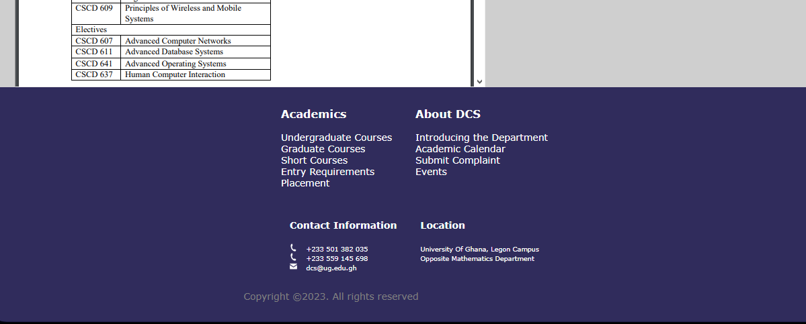


---
## **Short Courses Page**

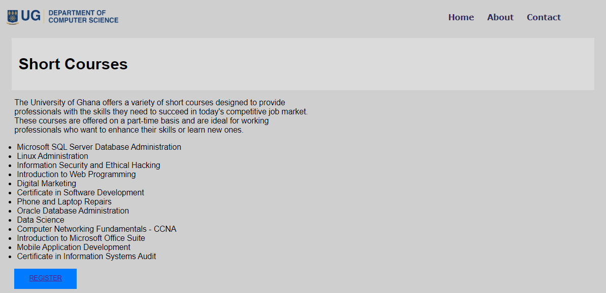


---
## **Entry Requirements Page**

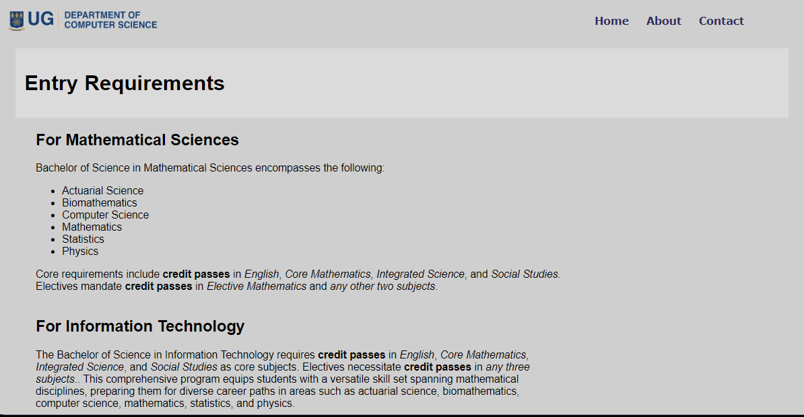


---
